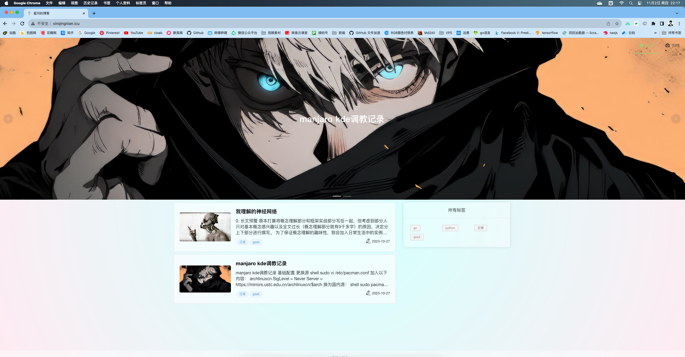
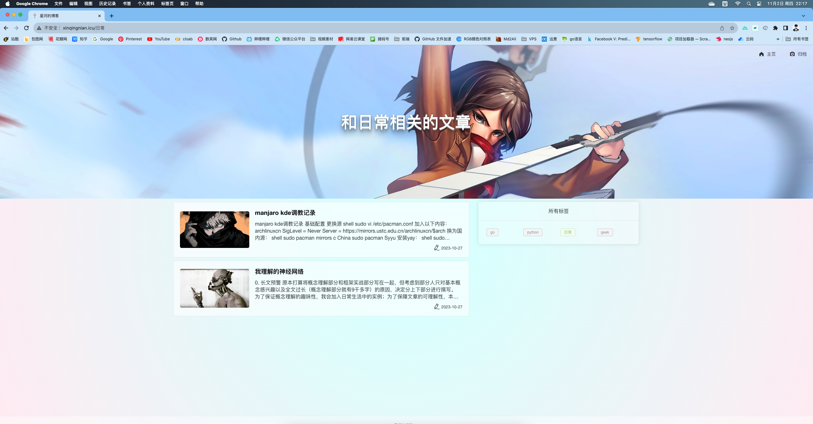
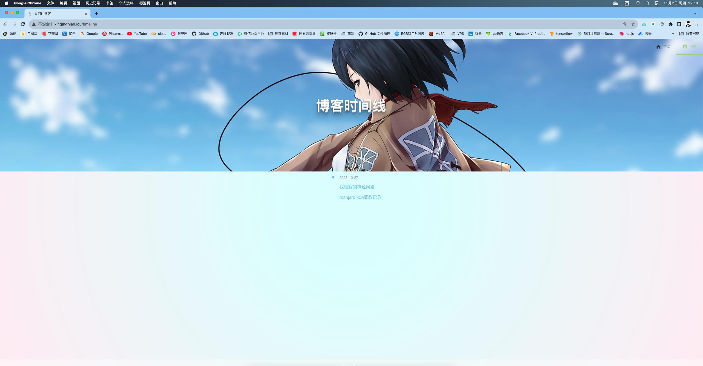
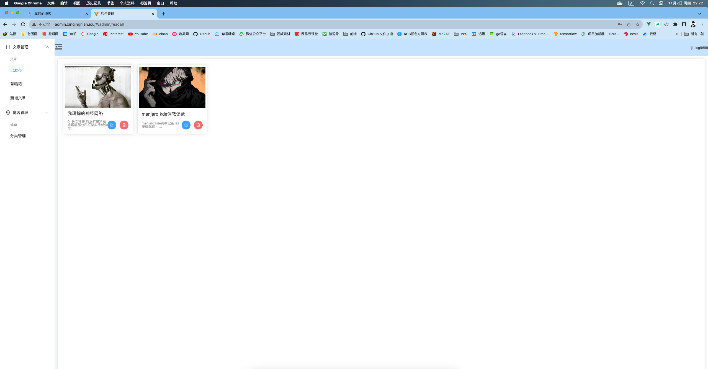
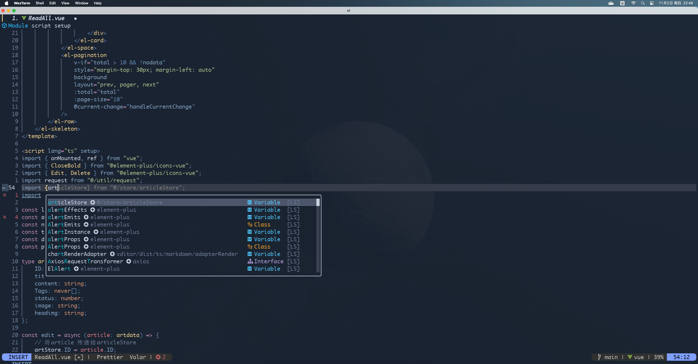

利用 2 个月的业余时间自己写了一个属于自己的极简博客，大部分功能都不支持非修改源码的方式自定义，部分功能会在后续添加，但会是一个私有库。其实这个项目相当简单，简单到有点弱智，但如果像我一样想学习，并且快速搭建自己的博客、而且简单操作，那这不失为一个不错的项目。

# 0. 技术栈

- 🖥 **客户端**: nuxtjs+elementPlus
- 🔥 **后台管理系统** : vue+elementPlus+pinia+axios
- ⚡ **后端** : gin

# 1. 快速部署

确保 nodejs >= 16.18，当然更低版本说不定可以没试过。

首先，利用 Nginx 部署 admin 后台。

```bash
cd admin-web/admin
yarn install
yarn build
mv dist /var/www/html
```

我建议的 Nginx 关于 Server 的配置块如下：

```conf

client_max_body_size  20m;
server{

   listen      80;
   server_name YourServerName;
   location / {
	alias    /var/www/html/;
	try_files $uri $uri/ /index.html;
	index index.html index.htm;
   }
   location /api/ {
        proxy_pass http://127.0.0.1:3001/;
proxy_set_header  Host $host;
        proxy_set_header  X-Real-IP        $remote_addr;
        proxy_set_header  X-Forwarded-For  $proxy_add_x_forwarded_for;
        proxy_set_header  X-NginX-Proxy    true;
    }
    location /img/upload {
           proxy_method POST;
           proxy_pass   http://127.0.0.1:3001$request_uri;
           proxy_set_header Authorization $http_Authorization;
    }
}

server {
   listen      80;
   server_name YourServerName;
   location / {
	    proxy_redirect                      off;
        proxy_set_header Host               $host;
        proxy_set_header X-Real-IP          $remote_addr;
        proxy_set_header X-Forwarded-For    $proxy_add_x_forwarded_for;
        proxy_set_header X-Forwarded-Proto  $scheme;
        proxy_read_timeout          1m;
        proxy_connect_timeout       1m;
        proxy_pass                          http://127.0.0.1:3000/;
   }
}
```

然后，利用 pm2 部署用户端。

```bash
cd use-web/web
yarn install
yarn build
pm2 start blog
```

用最简单的 screen 运行 go 程序。

```bash
cd blog-server
screen -S blog
./linuxServer
```

**在此之前** 你需要创建`conf/config.yaml` 格式如下：

```yaml
mysql:
  url: "(YourIP:YourPort)/myblog"
  username: "USERNAME"
  password: "PASSWORD"

secret:
  key: "ANYTHING"

tencent:
  SecretId: "这里是腾讯云对象储存给你的一个ID"
  SecretKey: "这里是腾讯云对象储存给你的一个key"
```

以上步骤不唯一，你可以使用任何你熟悉的方式。

# 2. 展示

客户端

<br/>
<br/>
<br/>

后台管理

<br/>

更多内容请访问[我的博客](http://xinqingnian.icu)

# 3. 强烈推荐

**vim 的~~补全~~ 插件:COC！** 在国产版 VSCode 横空出世后，让我痛心疾首，其实国内有相当多的开源作品，但都因为比较小众不为人所知，于是我立刻卸载 Neovim 关于内置 lsp 的插件，装上 coc。因此该项目所有内容均依靠 Neovim+coc 完成，coc 对 TypeScript 的超级 nice 支持，以及简单的配置，让我非常省心，之前使用 lsp 时经常会遇到提示莫名其妙弹不出来。虽然 coc 的补全需要依靠 Nodejs，占内存，但是比起 IDE 还是超级轻量。如果你也在使用 vim，请一定不要错过。

我的 Neovim+coc 展示：


- cocnvim: [coc.nvim](https://github.com/neoclide/coc.nvim)
- 我的 Neovim 配置: [xinghe98/neovim_lua](https://github.com/xinghe98/neovim_lua)

# Q & A

**Q** ：该项目时候会继续更新|维护？

**A** : 当然，但是更复杂的功能会在另一个私有库进行。

**Q** ：这么多博客项目，为什么要自己写一个？

**A** : 他们写的太复杂的了，我不会用。连 WordPress 的后台我都整不明白。
